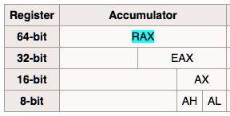
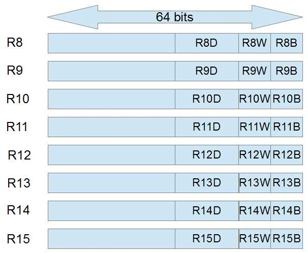

## Assembly Syntax

There are 2 types of styles of assembly code: Intel and AT&T. The main difference is: In Intel syntax the first operand is the destination, and the second operand is the source whereas in AT&T syntax the first operand is the source and the second operand is the destination. Here is a brief example of Intel and AT&T syntax:

|   Intex Syntax   |        AT&T        |
| :--------------: | :----------------: |
|  mov     eax,1  |  movl    $1,%eax  |
| mov     ebx,0ffh | movl    $0xff,%ebx |
|   int     80h   |   int     $0x80   |

Please refer the [reference](https://imada.sdu.dk/u/kslarsen/dm546/Material/IntelnATT.htm) to dive deeper. This article will be based on Intel syntax.

## Some Registers

- rax: 8 bytes register. registers starts with letter "r" occupy 8 bytes
- eax: 4 bytes register. The lowest 4 bytes of eax register
- ax: 2 bytes register. The lowest 2 bytes of eax register
- ah: 1 byte register. The highest byte of ax register
- al: 1 byte register. The lowest byte of ax register

## Special Registers

- rip: Program counter (PC) register. In contains 2 parts: segment address and offset. The segment address stores the segment of executing program and the offset is the offset of next instruction.
- rsp: The offset address of current top stack frame (when function is called).
- rbp: The bottom address of current bottom stack frame (when function is called).
- rax: General purpose register. For storing the return value of function call.

## General Purpose Registers

### 16 Bits General Purpose Registers

In 16 bits general purpose registers, the higher/lower 8 bits of ax, bx, cx, dx registers can be used by other registers. For example, the higher 8 bits register is represented by letter h, and lower 8 bits register is represented by letter l. For example:

- ax: ah, al
- bd: bh, bl
- cx: ch, cl
- dx: dh, dl

### 32 Bits General Purpose Registers

Extend 16 bits general purpose registers to get 32 bits general purpose registers.

- eax
- ebx
- ecx
- edx
- esi
- edi
- esp
- ebp

### 64 Bits General Purpose Registers

Extend 32 bits general purpose registers to get 64 bits general purpose registers.

- rax
- rbx
- rcx
- rdx
- rsi
- rdi
- rsp
- rbp

Besides, there are 8 extra registers:

- r8
- r9
- r10
- r11
- r12
- r13
- r14
- r15

The registers shared with same name (without prefix r, e) are not different registers. They are actually the same register.Take rax as an example:



Correspondingly, the extra 8 registers of 64 bits share the same naming convention.



## Segment Registers

Each segment register (cs, ds, ss, ed, fs, gs) preserves a 16 bits segment selector, to mark different segments of program (Please recap about [segments and sections](/PWN/SegmentsandSections/index.html)).

- cs: text segment
- ss: stack segment
- ds, es, fs, gs: data segment

## FLAGS Register

The FLAGS register is the status register that contains the current state of an x86 CPU. In 32 bits mode, FLAGS register is called EFLAGS, in 64 bits mode, it is called RFLAGS. The upper 32 bits of RFLAGS are preserved bits (not exactly all 0s but with fixed bits) and lower 32 bits are identical with EFLAGS.

## Instruction Pointer Registers

Instruction pointer registers work like PC (Program Counter). They stores the address of next instruction to be executed by CPU. They are generally be referred as ip, eip, rip (16 bits/32 bits/64 bits).

## Program Execution

### Static Linkage


### Dynamic Linkage


ld.so: load the address of dynamic linked libraries

## Common amd64 Instructions

### MOV

```s
MOV RAX, RCX
```

move the value stored in source operand (`rcs`) to destination operand (`rax`). If the instruction is `mv rax, eax`, the upper 32 bits will be all 0s after the assignment, even if the source operand is an immediate number.

Only first 4 registers (a, b, c, d)'s byte registers' value can be assigned interchangeably. Assume the value in `rax` is 0xFFFFFFFFFFFFFFFF (64 bits all 1s), and the value in `rbx` is 0xFFFFFFFFFFFFFF01. Then execute the following instruction:

```s
MOV AH, BL
```

Then value is `rax` will be 0xFFFFFFFFFFFF01FF. Note: this operation will not clear the rest bits to 0.

And the instruction like follow is illegal:

```s
MOV AH, BPL
```

Because `rbp` is not first 4 registers.

When source operand is embrace by square brackets, it means the load the value stored in the address whose value is the value stored in source operand and load it to the destination register. For example, let's assume that the value of `rcx` is 0x00000291C49F0000 and the value in address 0x00000291C49F0000 is 0xFFFFFFFFFFFFFFFF.

```s
MOV EAX, [RCX] // Or MOVE EAX, DWORD PTR DS:[RCX]
```

After executing the above instruction, th value of `rax` should be 0x00000000FFFFFFFF. Note: If you want to assign a register with value directly from an address, this register must be `rax`. No other registers can do that.

QWORD: 8 bytes, for registers starts with `r`, e.g. `rax`.
DWORD: 4 bytes, for registers starts with `e`, e.g. `eax`.
WORD: 2 bytes, for registers starts without prefix and ends with `x`, e.g. `ax`.
BYTE: 1 byte, for registers ends with `l` or `h`, e.g. `ah`.

DS: data segment

### INC&DEC

INC: Increase the value in register by 1
DEC: Decrease the value in register by 1

Syntax:

```s
INC RAX
DEC RAX
INC [RAX] // Increase the value stored in the address by 1
DEC [RAX] // Decrease the value stored in the address by 1
```

INC and DEC will affect following bits in FLAGS register:

- PF (bit 2) Parity flag — Set if the least-significant byte of the result contains an even number of 1 bits;
  cleared otherwise.
- AF (bit 4) Auxiliary Carry flag — Set if an arithmetic operation generates a carry or a borrow out of bit
  3 of the result; cleared otherwise. This flag is used in binary-coded decimal (BCD) arithmetic.
- ZF (bit 6) Zero flag — Set if the result is zero; cleared otherwise.
- SF (bit 7) Sign flag — Set equal to the most-significant bit of the result, which is the sign bit of a signed
  integer. (0 indicates a positive value and 1 indicates a negative value.)
- OF (bit 11) Overflow flag — Set if the integer result is too large a positive number or too small a negative
  number (excluding the sign-bit) to fit in the destination operand; cleared otherwise. This flag
  indicates an overflow condition for signed-integer (two’s complement) arithmetic.

## ADD & SUB

Syntax:

```s
ADD RAX, RAC    // add the value of RAX and RAC and store the sum in rax
SUB RAX, 0x28   // subtract 0x28 from RAX and store the difference in rax
```

ADD and SUB will affect following bits in FLAGS register:

- CF (bit 0) Carry flag — Set if an arithmetic operation generates a carry or a borrow out of the mostsignificant bit of the result; cleared otherwise. This flag indicates an overflow condition for
  unsigned-integer arithmetic. It is also used in multiple-precision arithmetic.
- PF (bit 2) Parity flag — Set if the least-significant byte of the result contains an even number of 1 bits;
  cleared otherwise.
- AF (bit 4) Auxiliary Carry flag — Set if an arithmetic operation generates a carry or a borrow out of bit
  3 of the result; cleared otherwise. This flag is used in binary-coded decimal (BCD) arithmetic.
- ZF (bit 6) Zero flag — Set if the result is zero; cleared otherwise.
- SF (bit 7) Sign flag — Set equal to the most-significant bit of the result, which is the sign bit of a signed
  integer. (0 indicates a positive value and 1 indicates a negative value.)
- OF (bit 11) Overflow flag — Set if the integer result is too large a positive number or too small a negative
  number (excluding the sign-bit) to fit in the destination operand; cleared otherwise. This flag
  indicates an overflow condition for signed-integer (two’s complement) arithmetic.
