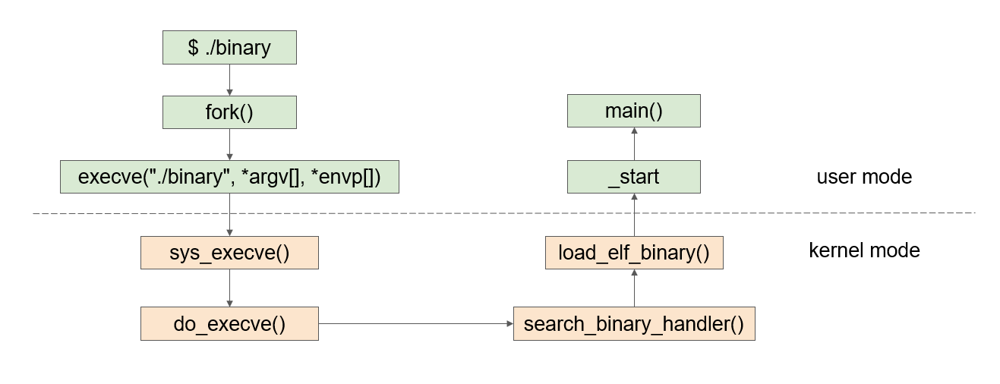
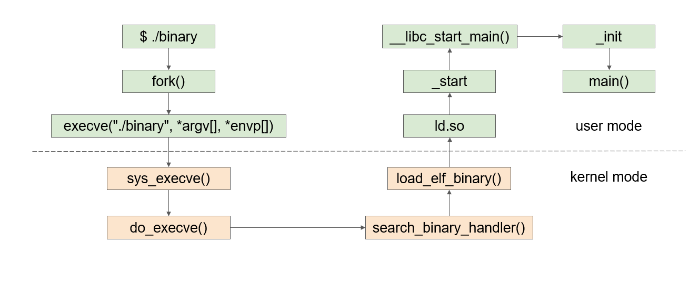

amd64 is a superset of x86 instruction set. Here I just talk a little bit about the amd64 register conventions.

## Registers

- rax: 8 bytes register. registers starts with letter "r" occupy 8 bytes
- eax: 4 bytes register. The lowest 4 bytes of eax register
- ax: 2 bytes register. The lowest 2 bytes of eax register
- ah: 1 byte register. The highest byte of ax register
- al: 1 byte register. The lowest byte of ax register

## Special Registers

- RIP: Program counter (PC) register. In contains 2 parts: segment address and offset. The segment address stores the segment of executing program and the offset is the offset of next instruction.  
- RSP: The offset address of current top stack frame (when function is called).
- RBP: The bottom address of current bottom stack frame (when function is called).
- RAX: General purpose register. For storing the return value of function call.

## Program Execution

### Static Linkage

### Dynamic Linkage

ld.so: load the address of dynamic linked libraries

## Common amd64 Instructions

- mov
- add/sub
