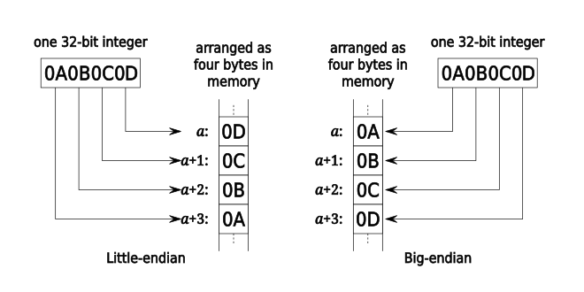

Endianness is a quite simple concept. They are 2 types of endianness: big endian and little endian. Nowadays most machines use little endian but for some old machines, they adopted big endian.

- Big Endian (BE)

Big endian is closer to human intuition. A big-endian system stores the most significant byte of a word at the smallest memory address and the least significant byte at the largest.

- Little Endian (LE)

A little-endian system, in contrast, stores the least-significant byte at the smallest address. It is more machine-friendly.

Here is a picture illustrates 2 types of endianness:



## Check endianness of your machine

```c
#include <stdio.h>
int main(int argc,char *argv[]){
        unsigned int data = 0x12345678;
        char *p; 
        p = (char*)&data; // truncate the int and preserve the data in the lowest address
         
        printf("data = 0x%0x  \n",data);
        printf("*p = 0x%0x\n",*p);
        printf("*(P+1) = 0x%0x\n",*(p+1));
        printf("*(p+2) = 0x%0x\n",*(p+2));
        printf("*(p+3) = 0x%0x\n",*(p+3));
        
        return 0;
}
```

And the result is:

```shell
data = 0x12345678  
*p = 0x78
*(P+1) = 0x56
*(p+2) = 0x34
*(p+3) = 0x12
```

This suggests that my machine is little endian because the lowest address least significant byte.

Or just use `file ./path/to/binary` to check, the result is:

```txt
test: ELF 64-bit LSB pie executable, x86-64, version 1 (SYSV), dynamically linked, interpreter /lib64/ld-linux-x86-64.so.2, BuildID[sha1]=87448cf8cb86cc4f35748f00efb1d0117a8f9c8d, for GNU/Linux 3.2.0, not stripped
```

`LSB` means this executable file is little endian.