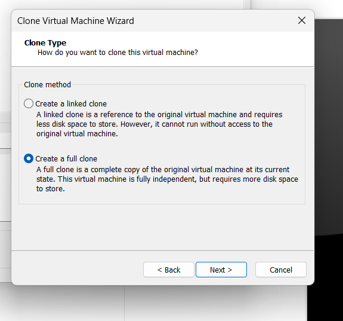
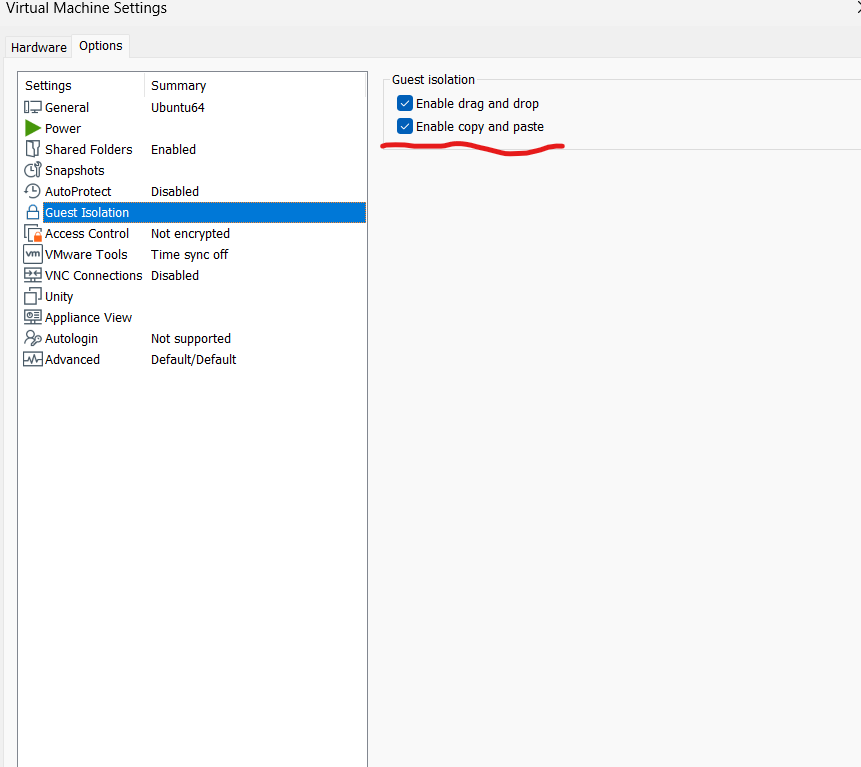
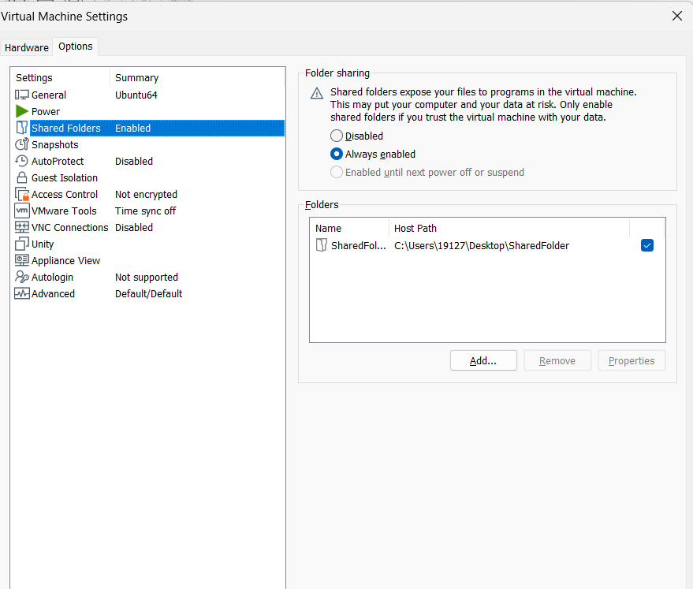
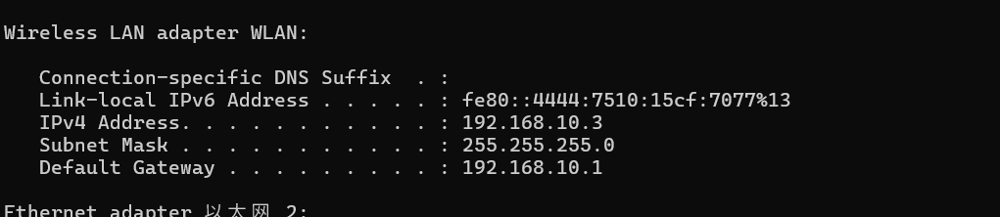
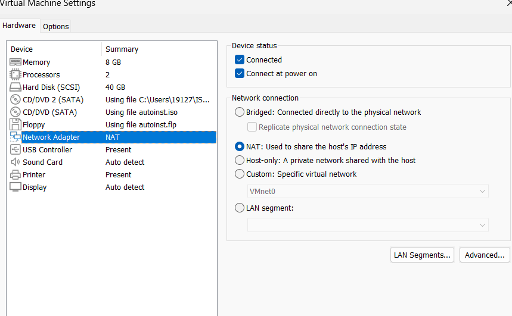
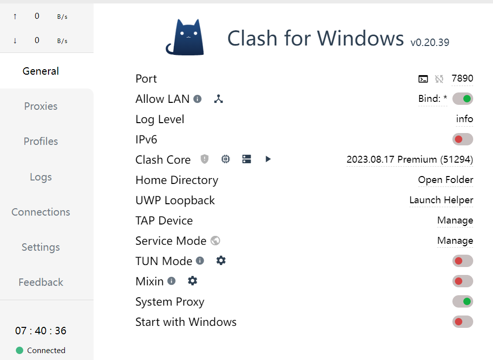
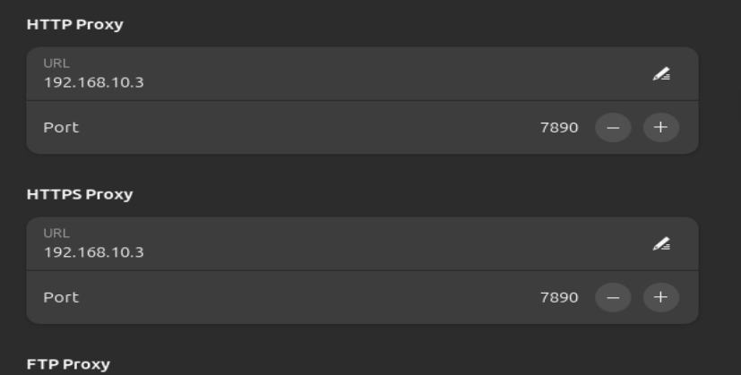

## What is virtual machine?

Virtual machine is software to simulate different OSes on one single physical machine. By adopting this technology, the software virtualize some features of physical devices, such as network adapters and hard disks, to allow operating systems run on these virtualized devices.

See [Document](https://www.vmware.com/topics/glossary/content/virtual-machine.html)

## Hypervisor

Hypervisors allow one host computer to support multiple guest VMs by virtually sharing its resources, such as memory and processing. Basically, there are 2 types of hypervisors. The first one, bare metal hypervisor, runs directly on the physical devices, and the second one coordinate the resource between source and VMs.

For more information, please check: [Video](https://www.youtube.com/watch?v=FZR0rG3HKIk&list=TLPQMDMwNzIwMjRW4uVlVvvBww&index=1) or [Document](https://www.vmware.com/topics/glossary/content/hypervisor.html)

## Containers VS VMs

They key of container is that it only runs 1 application with its dependencies, but for VM, it is more like a virtualized OS that allow different applications to run simultaneously.

## Snapshot

Once a Snapshot is taken, it records the current state of virtual machine and generates 2 files: one is a descriptor file points to the disk file and another is the disk file records the changed information. The snapshot allows user to revert to previous state or to clone different states of virtual machine. To clone the snapshot, there are 2 options: the first one creates a reference to the current snapshot, which is more space-efficient but once the disk file of current snapshot is lost, the cloned VM will lose its data; another method is like deep copy, which duplicates the entire disk file of existed snapshot.

See [Video](https://www.youtube.com/watch?v=TbRLu8koF1w&list=PLtjUJ_XpOTPHQrN6UBxop5jWa5H8Sg_SU&index=24)

## Network of VM

Bridged Mode:

The host NIC will receive different IP addresses from DHCP server and allocate them to VMs, as if they are other physic machines. Other computers in the network can also access VMs through their IP address.

NAT Mode:

The virtual DHCP server assign IP addresses to each VM, and they form a private network. You cannot access your VM directly from another device on your network unless port forwarding rules are set up on the host computer. The network flow from VMs will be treated as from host.

Host Only Mode:

VMs can talk with each other and with their host. However, the devices from the external network cannot access them. This is used for set up isolated virtual private network to allow cyber attack experiments.

See [Video](https://www.youtube.com/watch?v=XCkKDWMYHME&t=116s)

## Pros and Cons of Virtual Machine

Advantages:

- Cost Efficiency: One of the biggest advantages of virtual machines over physical servers is that they require fewer hardware resources. This translates into cost savings as you don't need additional hard drives or server space because a single machine can host multiple VMs and run multiple applications.
- Security: Since each virtual machine runs independently, it's isolated from other machines. This helps provide a greater level of security for each machine, as any malware or malicious attacks will not spread across multiple machines.
- Flexibility: This is one of the advantages of virtual machines in cloud computing. Since virtual machines are software-based, it is easy to spin up new ones if needed. This makes it incredibly convenient to scale your computing resources per your needs without purchasing additional hardware.
- Ease of Use: Virtual machines are incredibly easy to manage as you don't have to worry about each machine's hardware or software configurations. You can install the VM software and create new virtual environments with a few clicks.
- Platform Independence: Virtual machines are independent, meaning you can simultaneously run multiple operating systems on the same hardware. This is especially useful for testing and development because you can test specific applications on different operating systems.
- Enhanced Employee Efficiency and Productivity: With VMs, employees can access their work from any device, anytime, anywhere. They can collaborate on joint projects without being physically available, improving their efficiency and productivity.
- ISA Structure: Virtual machines come designed with an instruction set architecture (ISA) structure. An ISA is a set of instructions that a processor understands, which makes it easier to design and manage the VM. ISA provides access to the system's underlying hardware and allows software developers to code applications that run on any hardware or operating system.
- Quick Disaster Recovery: The importance of virtual machines in cloud computing can't be overstated regarding disaster recovery. You can easily back up and recover virtual machines. Moreover, since each virtual environment is independent, the running applications and data remain safe in case of a system crash or hardware failure.

Disadvantages:

- Performance Issues: Although virtual machines can benefit businesses in terms of cost efficiency and flexibility, they can also cause performance issues if not configured properly. Since multiple virtual machines share the same hardware resources, it can lead to decreased performance and efficiency.
- High Initial Costs: Implementing virtual machines can be expensive as you must purchase the VM software and storage space. This makes it costlier than installing physical servers for each application. The disadvantages of virtual machines in cloud computing include the cost of cloud hosting platforms.
- Security Risks: Although VMs are more secure than traditional physical servers, they still come with security risks, such as malware and malicious attacks within the virtual environment. To ensure maximum security, it is important to configure the VMs properly and use advanced security tools.
- Complexity: Virtual machines are software-based and can be complex to understand. Therefore, you need expert help to configure and manage these systems. This can be very costly if you don't have an in-house IT team.
- Server Sprawl: Virtual machines are easy to spin up and manage. This can lead to server sprawl when you create too many VMs you don't actively use. Eventually, your hardware and maintenance costs may be too high to afford.

To dive deeper into background information about virtual machines, please visit: [Introduction to VMware](https://www.vmware.com/topics/glossary/content/virtual-machine.html#:~:text=Advantages%20of%20virtual%20machines,space%2C%20time%20and%20management%20costs.)

## Installation

Please follow the content in the video to install your virtual machine:

[Install](https://www.youtube.com/watch?v=Q0Na0f1NtpA&t=181s)

After you creates a virtual machine, you will need to install VMware tools to enable some features:

[VMware tools](https://www.youtube.com/watch?v=r41SLC5zzCg&t=47s)

**Notes**: the ISO file is the image file of the operating system of your virtual machine. In this case, the OS of the virtual machine is Ubuntu, which is a famous distro of Linux OS. Besides, VMware workstation only supports hosts that run on Windows or Linux, it means that if you are using Mac, you should find some alternatives, such as virtualbox to install your virtual machine.

## Basic Configuration

### Sharing Clipboard

By default, VMware doesn't support shared clipboard between virtual machines and host. So to enable this, goto `VM->Settings`, and a setting window will be prompted. Then select `options->guest isolation` in the window, check `enable copy and paste`, click `OK` button at bottom. Now you should be able to copy and paste between virtual machine and host.

### Sharing Folders

To transfer files between host and VMs, you can use shared folders. To enable it, go to `VM->Settings`, and when a window pops out select `options->SharedFolders`. You can share different folders of hosts with VMs.

In the guest machine, the shared folders are in directory of `/mnt/hgfs`

### Using VPN from Host Machine

1. Find the IP address of host, by typing `ipconfig` in your CMD:

2. Make sure you are using NAT mode to connect with Internet:

3. Remember the port number of your proxy, and enable `Allow LAN` if there is an option on your proxy client:

4. Open `Settings->Network->Proxy` in Ubuntu OS, switch mode to manual, input the ip address of the host and port number of you proxy client. If you just want to browse contents of Internet, selecting `HTTP` and `HTTPS` proxies is enough.

## More Info

To access more information about VMware Workstation Pro, please read the official document:

[Document](https://docs.vmware.com/en/VMware-Workstation-Pro/17/com.vmware.ws.using.doc/GUID-0EE752F8-C159-487A-9159-FE1F646EE4CA.html)
